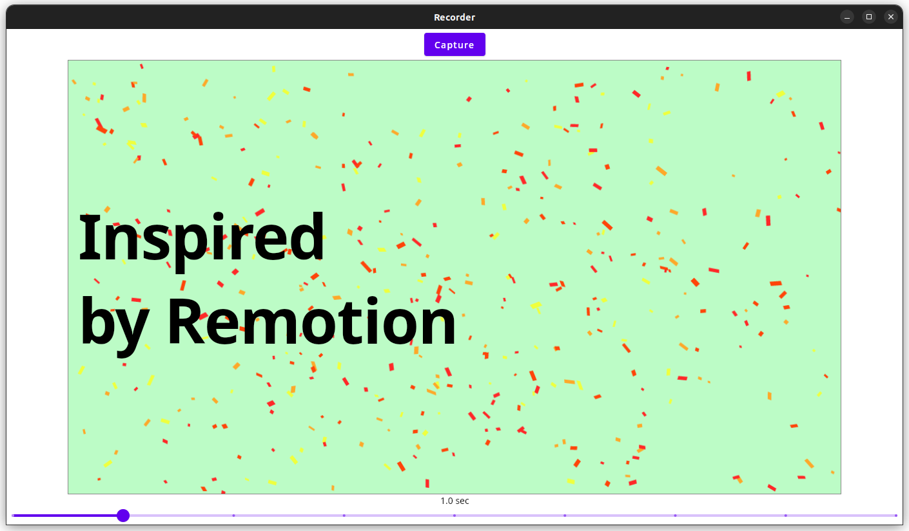

# Compose Movie Maker

Could it be possible to create a MP4 video if you only use Jetpack Compose?

This idea is heavily inspired from [Remotion](https://github.com/remotion-dev/remotion)
by [Jonny Burger](https://github.com/JonnyBurger),
"build a framework for creating videos programmatically using React".

By doing it you can prepare/code templates of videos and make them configurable,
so you don't have to re-do the entire video montage every you want to adjust a text or animation. 


## How-to

### Scene 1

```kotlin
BigTitle(
    title = { modifier ->
        Text(
            modifier = modifier.padding(16.dp),
            text = "Inspired\nby Remotion",
            style = MaterialTheme.typography.h1,
            fontWeight = FontWeight.Bold
        )
    }
)
```

### Scene 2

```kotlin
Headline(
    title = "100% Jetpack Compose",
    millisToShowFullLength = 2_000L
)
```

### Scene 3

```kotlin
AvatarTitleSubTitle(
    image = { modifier ->
        Image(
            modifier = modifier.clip(CircleShape),
            painter = painterResource("avatar.png"),
            contentScale = ContentScale.Crop,
            contentDescription = null
        )
    },
    title = { modifier ->
        Text("Olivier PEREZ", modifier = modifier, style = MaterialTheme.typography.h3)
    },
    subTitle = { modifier ->
        Text(
            "Compose Movie Maker : le 7ème art à portée de composants web et d'API \uD83C\uDFAC ",
            modifier = modifier,
            style = MaterialTheme.typography.h5
        )
    }
)
```

### Assemble the whole to record it

```kotlin
RecorderBox(
    fps = 30,
    dimension = Dimension(1200, 675),
    modifier = Modifier.fillMaxSize()
) {
    BigTitle(
        modifier = Modifier.scene(2_000L),
        // ...
    )
    Headline(
        modifier = Modifier.scene(4_000L),
        // ...
    )
    AvatarTitleSubTitle(
        modifier = Modifier.scene(2_000L),
        // ...
    )
}
```


